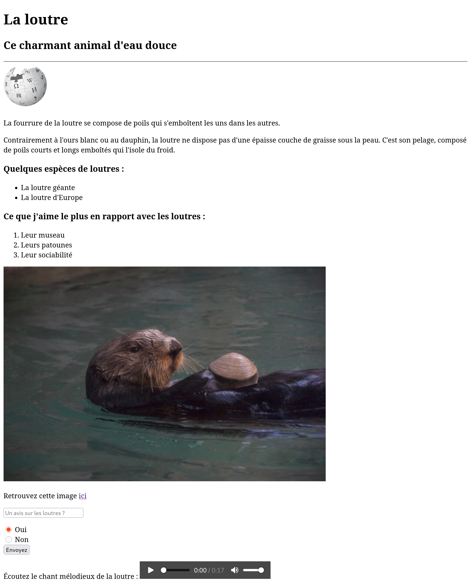

# DevWeb : Série 1
## Exercice 1
Essayez de reproduire au maximum une page HTML qui ressemblerait à la photo ci-après :

Le lien pour les images et audio : [Wikipedia](https://upload.wikimedia.org/wikipedia/commons/a/a3/Wikipedia-logo-v2-square.svg), [loutre](https://img.freepik.com/photos-premium/loutre-nageant-dans-lac_1048944-19016970.jpg?semt=ais_hybrid&w=740&q=80), [cri de loutre](https://prolutra.ch/wp-content/uploads/2020/04/Cries__Mewing_D%C3%A4hlh%C3%B6lzli.wav?_=1)\
N'hésitez pas à faire un tour sur les pages [MDN](https://developer.mozilla.org/en-US/docs/Web/HTML/Reference/Elements/input) des balises pour voir comment les utiliser.
## Exercice 2
Soyez créatif·ves et créez une page sur le sujet de votre choix (par exemple un autre animal qui vous tient à coeur).